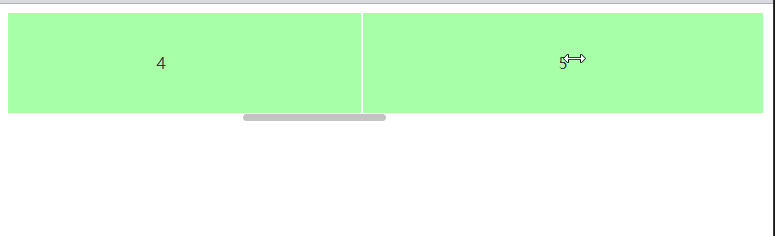

## Installation

#### npm

```sh
$ npm install vue3-dragscroll
```

Then, in your JavaScript file:

```js
// Register dragscroll globally
import Vue3Dragscroll from 'vue3-dragscroll'
Vue.use(Vue3Dragscroll)
```

## Usage

Add the `v-dragscroll` directive to a scrollable element:

```html
<div v-dragscroll>
    Big text goes here...
</div>
```

## 效果

手机上我们可以拖拽来实现滚动条滚动效果，但在浏览器上我们必须拖拽滚动轴，or 鼠标滚轴，来实现滚动

当横向滚动时，我们需要 shift + 鼠标滚轴来进行滚动，这个时候，如果能够拖拽滚动，那么效果会好很多

效果：

图片
